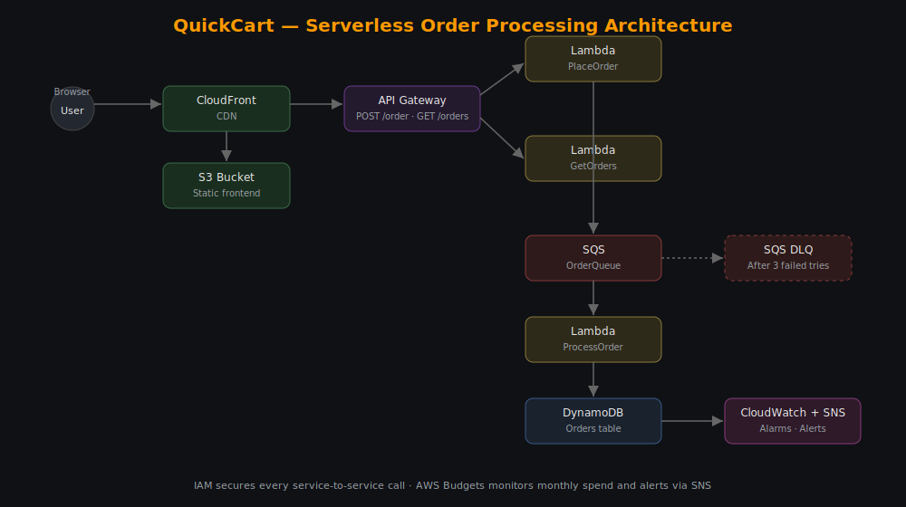

# QuickCart — Serverless Cost-Optimized Order Processing System on AWS

A fully serverless, event-driven order processing pipeline built on AWS. Scales to zero at idle, absorbs traffic spikes without dropping orders, and stays within a fixed monthly budget.



---

## Problem

Traditional always-on checkout systems have four recurring issues:

- **Idle cost** — a server running 24/7 costs the same at 3 AM with zero traffic as during a spike with thousands of orders/minute.
- **Traffic spikes cause failures** — a fixed-capacity server chokes under sudden load, and orders get dropped.
- **Synchronous writes block checkout** — if the "save to database" step is slow or fails, the customer waits or the order is silently lost.
- **No visibility** — failures go unnoticed until a customer complains; spend is unpredictable until the bill arrives.

## Solution

QuickCart replaces the always-on server with a fully serverless, decoupled pipeline:

- **API Gateway + Lambda** — nothing runs, and nothing costs money, when there's no traffic.
- **SQS** — the checkout API queues the order and responds immediately; a separate Lambda processes it asynchronously, so spikes are absorbed instead of causing failures.
- **SQS Dead Letter Queue** — if an order fails processing 3 times, it's isolated in a DLQ instead of being lost or retried forever.
- **DynamoDB with idempotency check** — every order is persisted with a status (`pending` → `completed`), and duplicate SQS deliveries are detected and skipped rather than double-written.
- **CloudWatch + SNS** — alarms on Lambda errors and queue backlog notify you before customers notice.
- **AWS Budgets** — alerts at 80% of a fixed monthly threshold so spend never silently grows.

---

## Architecture

```
User Browser
     │
     ▼
CloudFront ──► S3 (static frontend)
     │
     ▼ (Place Order / Get Orders)
API Gateway
     │
     ├──► Lambda: PlaceOrder ──► SQS (OrderQueue) ──► Lambda: ProcessOrder ──► DynamoDB
     │                                  │                       │
     │                                  ▼ (after 3 failures)    │
     │                              SQS DLQ                     │
     │                                                           │
     └──► Lambda: GetOrders ◄───────────────────────────────────┘
                    │
                    ▼
            (returns order list to frontend for live status table)

CloudWatch Alarms ──► SNS ──► Email/SMS alerts
AWS Budgets ──► SNS ──► Cost alerts
IAM ──► least-privilege role on every Lambda
```

**Services used:** S3, CloudFront, API Gateway, Lambda, SQS (+ DLQ), DynamoDB, CloudWatch, SNS, IAM, AWS Budgets.

---

## Repository Structure

```
quickcart-aws/
├── frontend/
│   ├── index.html          # Product page + live order status table
│   └── app.js               # Calls API Gateway, polls order status
├── backend/
│   ├── place-order/index.js     # Lambda: validates order, sends to SQS
│   ├── process-order/index.js   # Lambda: SQS trigger, idempotent DynamoDB write
│   ├── get-orders/index.js      # Lambda: returns recent orders for dashboard
│   └── package.json
├── architecture/
│   └── architecture-diagram.svg
└── README.md
```

---

## Manual AWS Setup Guide

Everything below is built by hand in the AWS Console — no CloudFormation/Terraform, so you understand every piece.

### 1. IAM
1. Create an IAM user for yourself with MFA enabled.
2. Create three execution roles:
   - `PlaceOrder-Role` → permission: `sqs:SendMessage` on `OrderQueue` only, plus basic Lambda logging.
   - `ProcessOrder-Role` → permission: `sqs:ReceiveMessage` / `sqs:DeleteMessage` on `OrderQueue`, `dynamodb:GetItem` / `dynamodb:PutItem` on the `Orders` table.
   - `GetOrders-Role` → permission: `dynamodb:Scan` on the `Orders` table.

### 2. DynamoDB
1. Create a table named `Orders`.
2. Partition key: `orderId` (String).
3. Use on-demand capacity mode (pay-per-request — no idle cost).

### 3. SQS
1. Create a **Dead Letter Queue** first: `OrderQueue-DLQ` (Standard).
2. Create the main queue: `OrderQueue` (Standard).
3. On `OrderQueue`, enable **Redrive Policy**: point to `OrderQueue-DLQ`, `maxReceiveCount = 3`.

### 4. Lambda Functions
For each function below: create it in the console (Node.js 20.x runtime), paste in the corresponding file from `backend/`, attach the matching IAM role, and set the environment variables listed.

| Function | Code file | Env vars |
|---|---|---|
| `PlaceOrder` | `backend/place-order/index.js` | `ORDER_QUEUE_URL` = your SQS queue URL |
| `ProcessOrder` | `backend/process-order/index.js` | `ORDERS_TABLE` = `Orders` |
| `GetOrders` | `backend/get-orders/index.js` | `ORDERS_TABLE` = `Orders` |

For each function, install dependencies locally and zip before uploading:
```bash
cd backend
npm install
cd place-order && zip -r ../place-order.zip . -x package.json && cd ..
# repeat for process-order and get-orders, or bundle node_modules per-function
```
(Or use the Lambda console's inline editor for simplicity, and attach a Lambda Layer for the `@aws-sdk` packages.)

5. On `ProcessOrder`, add a trigger: **SQS → OrderQueue**, batch size 1 (or higher once you're comfortable).

### 5. API Gateway
1. Create a new **HTTP API** (cheaper than REST API for this use case).
2. Add route `POST /order` → integrate with `PlaceOrder` Lambda.
3. Add route `GET /orders` → integrate with `GetOrders` Lambda.
4. Enable CORS (allow your CloudFront domain, or `*` for demo purposes).
5. Deploy to a stage (e.g. `prod`) and copy the invoke URL.

### 6. Frontend (S3 + CloudFront)
1. In `frontend/app.js`, replace `API_URL` with your API Gateway invoke URL.
2. Create an S3 bucket, upload `index.html` and `app.js`.
3. Block all public access on the bucket.
4. Create a CloudFront distribution with **Origin Access Control (OAC)** pointing to the bucket — only CloudFront can read from it.
5. Test: open the CloudFront domain in a browser.

### 7. CloudWatch + SNS
1. Create an SNS topic `QuickCartAlerts`, subscribe your email.
2. Create alarms:
   - `ProcessOrder` Lambda errors > 0
   - `OrderQueue` `ApproximateNumberOfMessagesVisible` > 10
3. Set alarm actions to notify `QuickCartAlerts`.

### 8. AWS Budgets
1. Billing → Budgets → create a monthly cost budget (e.g. $10).
2. Alert at 80% actual/forecasted spend → send to `QuickCartAlerts`.

---

## Testing the Full Flow

1. Open the CloudFront URL → click **Place Order** on any product.
2. Watch the order appear in the status table within a few seconds (`pending` → `completed`).
3. In DynamoDB console, confirm the item was written.
4. To test failure handling: temporarily remove `ProcessOrder`'s DynamoDB permission, place an order, and confirm it lands in `OrderQueue-DLQ` after 3 retries.
5. Confirm a CloudWatch alarm and SNS email fire when you intentionally break something.

---

## Why These Design Choices

- **SQS between the API and the database write** — the customer gets an instant "order accepted" response; the actual processing happens asynchronously, so a slow or failing database write never blocks checkout.
- **Idempotency check in `ProcessOrder`** — SQS guarantees *at-least-once* delivery, meaning a message can occasionally be delivered twice. Without a check, that could double-charge or double-count an order.
- **Dead Letter Queue** — prevents infinite retry loops and makes failed orders visible and inspectable instead of silently disappearing.
- **On-demand DynamoDB + serverless everything** — the whole system costs close to nothing when idle, and scales automatically under load without any manual intervention.

---

## License

MIT — feel free to fork and adapt.
